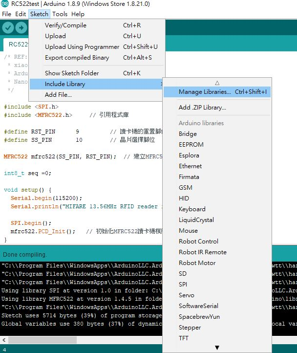
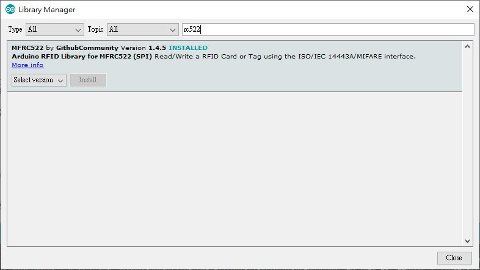
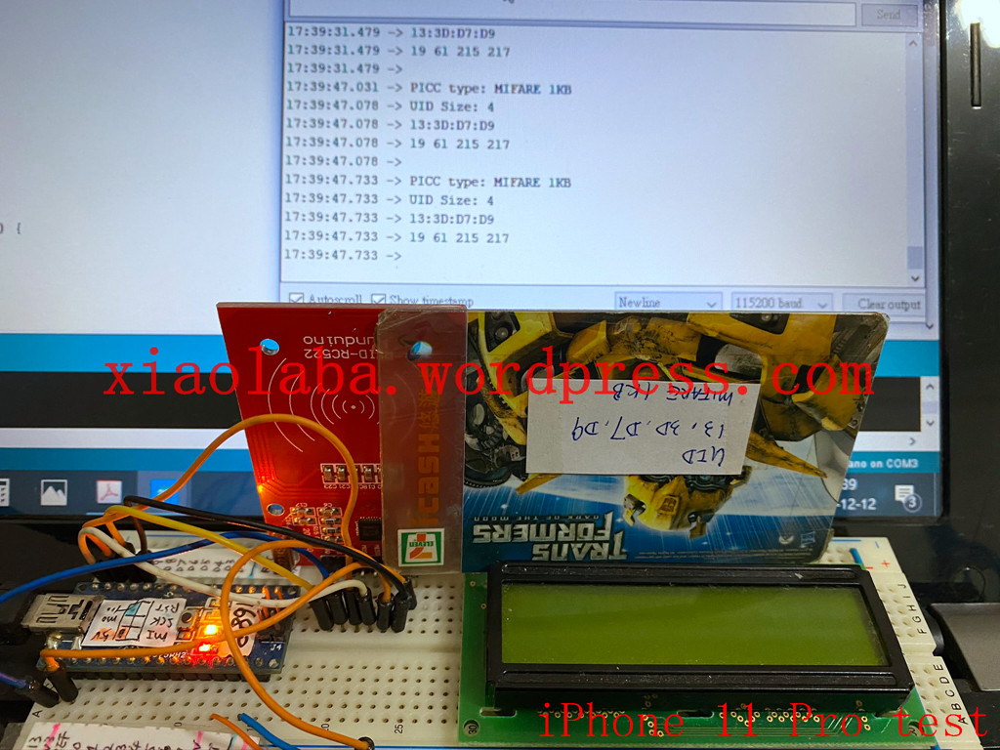
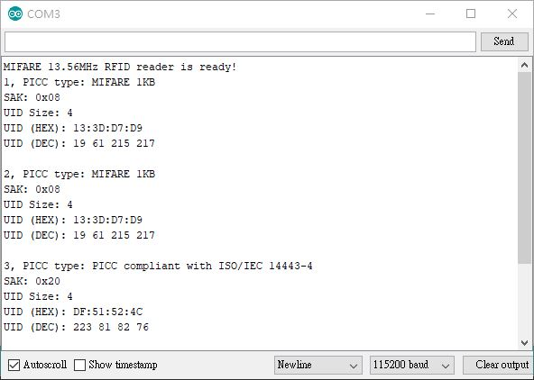

# MIFARE_RC522_testing
MIFARE RC522 testing  

REF: https://swf.com.tw/?p=930

[AN10833_MIFARE_Type_Identification_Procedure_Rev3.6_11_July_2016.pdf](AN10833_MIFARE_Type_Identification_Procedure_Rev3.6_11_July_2016.pdf)  
  
  
  
  
Arduino IDE 1.8.9  
import & install library for RC522

  

  
hardware setup  
  
Arduino Nano pin# <-> RC522 pin#

3.3V - VCC  
GND - GND  
D9 - RST  
D10 - NSS  
D11 - MO  
D12 - MI  
D13 - SCK  

  
  
Output  

source code,   
pre-build hex also included.

